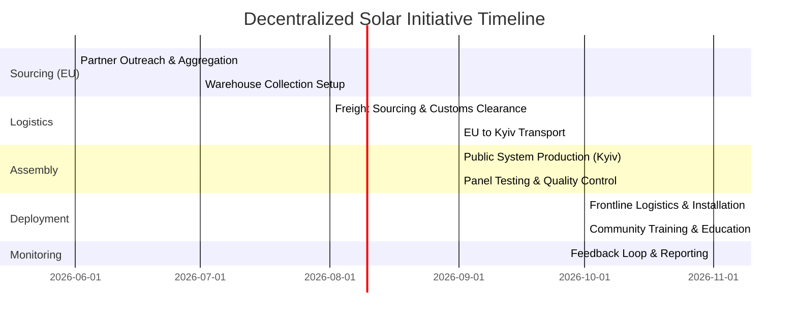

# NGO Kosmos Tabir — Decentralized Solar Initiative Roadmap

This document outlines the strategic phases, logistics pathway, and operational timeline for deploying decentralized solar stations across key public administrative and community buildings (village councils, medical outposts/FAPs, schools, kindergartens, and resilience hubs) in Ukraine's frontline and de-occupied regions. This roadmap is shared with European partners to demonstrate operational readiness and transparency.

---

## Strategic Phases

---

### Phase 1: Sourcing & Collection (Months 1–3)
**Objective**: Secure commitments for used solar panels, related equipment (inverters, cables, tools), transport vehicles, and micro-funding.
* **Lead Generation**: Compile a list of 100+ European solar developers, installers, recycling organizations, and corporate foundations.
* **Agreement Sign-offs**: Establish legal donation frameworks to handle asset write-offs and customs waivers.
* **Hub Sourcing**: Setup consolidation hubs in cooperation with European warehouses (primary targets: Krakow, Poland; Munich, Germany; Rotterdam, Netherlands).
* **Equipment Guidelines**: We accept panels (80%+ efficiency, 200W+ capacity) and mounting/wiring gear. **We strictly do not accept used batteries** (all battery storage systems are procured new and locally for safety and reliability).

### Phase 2: Logistics & Customs Clearance (Months 2–4)
**Objective**: Transport consolidated solar panels and hardware from EU warehouses to Ukraine.
* **Customs Coordination**: Register cargo as official humanitarian aid under the Ministry of Social Policy of Ukraine to bypass standard import tariffs and speed up border crossings.
* **Freight Transport**: Match cargo with logistics sponsors (seeking partners to provide transport support or utilize empty backhaul capacity).
* **Kyiv Hub Delivery**: Deliver all solar modules and mounting hardware to our central storage facility in Kyiv.

### Phase 3: Assembly & Quality Control (Months 3–5)
**Objective**: Build/configure power distribution systems and verify the integrity of used solar panels.
* **System Assembly**: Assemble power units (inverters, charge controllers, new battery enclosures) in Kyiv.
* **Panel Sorting & QA**: Test every donated panel using portable load testers:
  * Panels with **80%+ remaining efficiency** are approved for public building installations.
  * Panels with **minor cosmetic cracks** but retaining **80%+ efficiency** are sealed with waterproof solar film and approved.
  * Panels below **80% efficiency** or any used battery submissions are rejected.

### Phase 4: Field Deployment & Local Training (Months 4–7)
**Objective**: Install solar stations on key public infrastructure and train local communities.
* **Regional Prioritization**: Coordinate with the Ministry of Energy and regional administrations (Kherson, Kharkiv, Sumy, Zaporizhzhia) to map blackouts and target buildings (village halls, clinics, schools, kindergartens).
* **Field Missions**: Deploy installation teams to target areas. Each mission covers multiple community hubs.
* **Capacity Building**: Train local staff and volunteers on basic solar maintenance and emergency safety protocols.

### Phase 5: Verification, Monitoring & Donor Feedback (Ongoing)
**Objective**: Provide 100% transparency and build trust with EU donors.
* **Verification Reports**: Send digital reports to each donor featuring:
  * Specific public buildings powered by their donated panels.
  * Geolocation (GPS coordinates) and photos of installations (taking safety and security constraints into account).
  * Direct testimonials from local doctors, teachers, and community heads.

---

## Key Performance Indicators (KPIs) & Track Record

* **Track Record**: Successfully electrified **40+ public administrative buildings** and deployed **400+ micro-solar units** (home units currently in the patenting stage for mass production).
* **Target**: Electrify public community infrastructure across **20+ frontline settlements**, securing power for local clinics, village halls, schools, and resilience points.
* **Material Repurposed**: **2,000+ functional solar panels** (80%+ efficiency) redirected from EU waste/storage to frontline lifelines.
* **100%** transparent tracking, showing donor organizations exactly where their panels are deployed.
